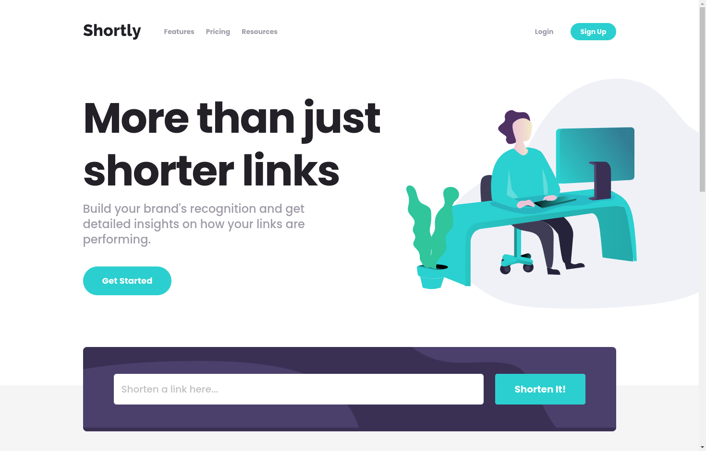

# Frontend Mentor - Shortly URL shortening API Challenge solution

This is a solution to the [Shortly URL shortening API Challenge challenge on Frontend Mentor](https://www.frontendmentor.io/challenges/url-shortening-api-landing-page-2ce3ob-G). Frontend Mentor challenges help you improve your coding skills by building realistic projects.

## Table of contents

- [Overview](#overview)
  - [The challenge](#the-challenge)
  - [Screenshot](#screenshot)
  - [Links](#links)
- [My process](#my-process)
  - [Built with](#built-with)
  - [What I learned](#what-i-learned)
  - [Continued development](#continued-development)
  - [Useful resources](#useful-resources)
- [Author](#author)

## Overview

### The challenge

Users should be able to:

- View the optimal layout for the site depending on their device's screen size
- Shorten any valid URL
- See a list of their shortened links, even after refreshing the browser
- Copy the shortened link to their clipboard in a single click
- Receive an error message when the `form` is submitted if:
  - The `input` field is empty

### Screenshot

### Links

- Solution URL: [Solution page on Frontend Mentor](https://your-solution-url.com)
- Live Site URL: [GitHub Pages](https://danayatsuta.github.io/frontend-mentor-url-shortening-api/)

## My process

### Built with

- [Vue.js](https://vuejs.org/)
- [Vite](https://vitejs.dev/)
- [Tailwind CSS](https://tailwindcss.com/)
- [Prettier](https://prettier.io/)
- [ESLint](https://eslint.org/)

### What I learned

This is the first major Vue.js project I have finished. I learned a lot about separating code into components and how to set up interactions between them with events and props.

### Continued development

I really enjoyed developing with Vue.js, but I still need to learn a lot about it, which I plan to do by building more projects with it.

### Useful resources

- [Vue.js Documentation](https://vuejs.org/guide/introduction.html) - official Vue.js documentation does a great job explaining Vue.js and provides an interactive tutorial that helped me to grasp a lot of basics of Vue.js very quickly.
- [LearnVue article on deploying to GitHub pages](https://learnvue.co/articles/deploy-vue-to-github-pages) - This article cleared things up on how to prepare my project for deployment on GitHub Pages.

## Author

- Frontend Mentor - [@danaYatsuta](https://www.frontendmentor.io/profile/danaYatsuta)
